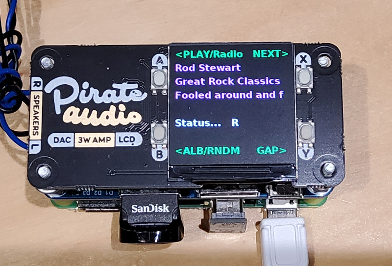

# Pi-Pirate-Audio-MP3-Radio-player

TESTED with RaspiOS 32bit BOOKWORM

You can use a USB hub, l added one of these https://www.waveshare.com/wiki/USB_HUB_HAT

# To install...

ensure SPI and I2C interfaces ON

sudo pip3 install st7789 --break-system-packages

sudo apt install python3-alsaaudio

sudo apt install mplayer

sudo pip3 install mutagen --break-system-packages

copy Pi_Pirate_MP3_Player.py to home directory

# To /boot/firmware/config.txt add...

dtoverlay=hifiberry-dac
 
gpio=25=op,dh

# To run at boot if using labwc

Add /usr/bin/python ~/Pi_Pirate_MP3_Player.py to ~./config/labwc/autostart
