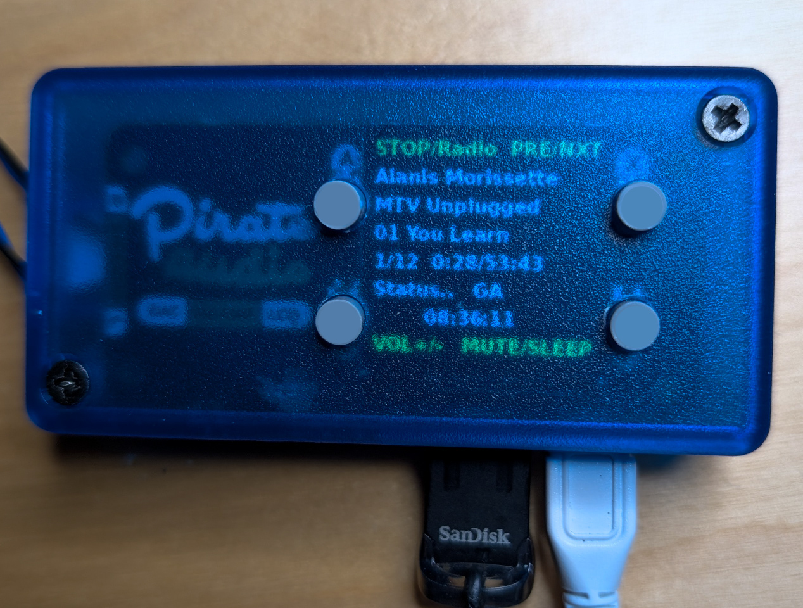

# Pi-Pirate-Audio-MP3-Radio-player

Features:
    * Play MP3s or Internet Radio
    * Album mode
    * Random mode
    * Gapless mode
    * Adjust Volume
    * Sleep timer
    * show album cover picture
    * show radio station logo picture

TESTED with RaspiOS 32bit BOOKWORM, and TRIXIE 64bit

On the USB sticks the format must be/media/USERNAME/USBNAME/Artist Name/Album Name/Track Names

on the sd card under /home/USERNAME/Music/Artist Name/Album Name/Track Names

Put Album Cover images in Album Name directory, use .jpgs and ideally 240 x 240.

If you can't see the text on the image you can add a file called colors.txt in the Album Name directory containing r,g,b values eg. 0,0,0 for black.

If you don't have an image and want a colored backround you can add a file called backgnd.txt in the Album Name directory containing r,g,b values eg. 200,0,0 for red.

Put Radio Station logo images in /home/USERNAME/, use .jpgs and ideally 240 x 240. Name must be same as Radio Stn + .jpg.
eg Radio Paradise Rock.jpg.

You can add more radio stations in a file named Radio_Stns.txt, format for each line : Station Name,Station URL,0

Press and release for first option, press and hold for second eg. VOL +/-, press and release will increase volume, 
press and hold will decrease volume.

# To install...

(NOTE: I am suggesting the use of --break-system-packages, this shouldn't be an issue if using this in a standalone
pi BUT if not then learn how to use venv !!)

ensure SPI and I2C interfaces ON

sudo pip3 install st7789 --break-system-packages

sudo apt install python3-alsaaudio

sudo apt install mplayer

sudo pip3 install mutagen --break-system-packages

copy Pi_Pirate_MP3_Player.py to home directory

# To /boot/firmware/config.txt add...

dtoverlay=hifiberry-dac
 
gpio=25=op,dh

# To run at boot if using labwc

Add /usr/bin/python ~/Pi_Pirate_MP3_Player.py to ~/.config/labwc/autostart
